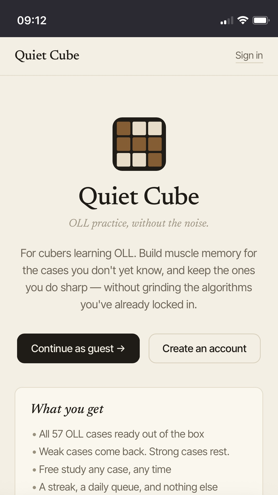
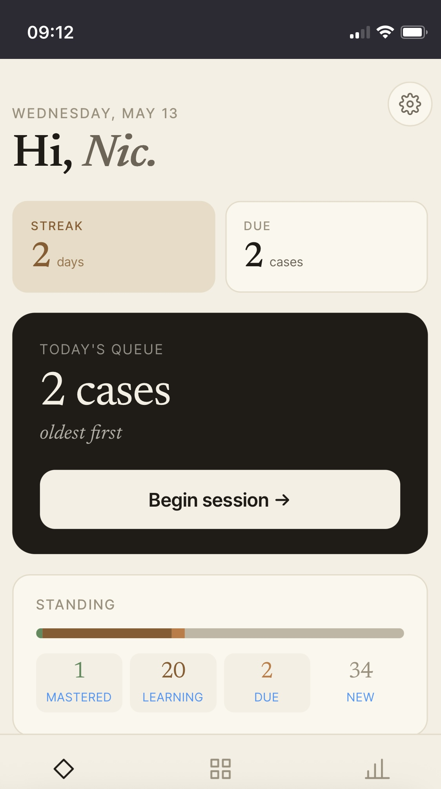
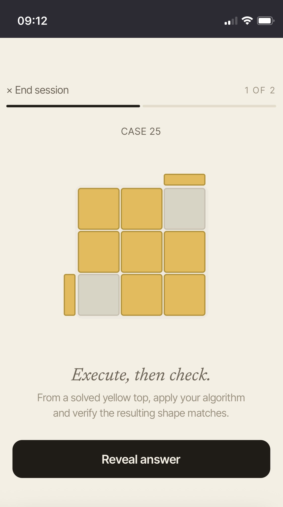
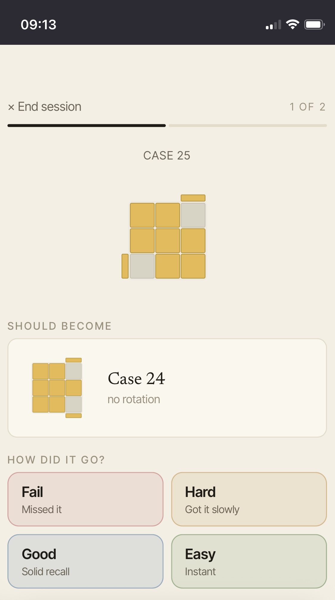
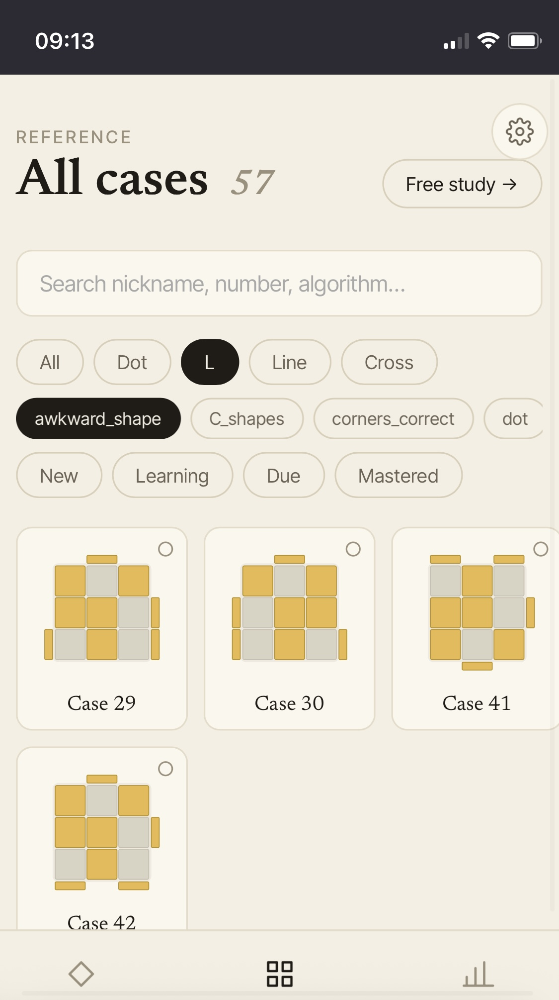
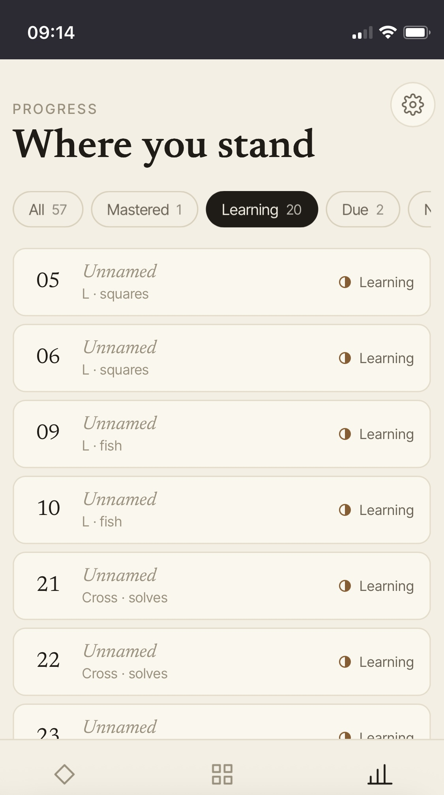

<p align="center">
  
</p>

# Quiet Cube

*A quiet place to drill.*

A spaced-repetition app for Rubik's cube algorithms. Pick a case, run the algorithm, grade yourself, and let the scheduler bring it back when you're about to forget it.

**Live at [quiet-cube.com](https://quiet-cube.com)** · **Status:** MVP feature-complete; final pre-launch pass in progress.

**Stack:** Rust + Axum + sqlx (backend), Vue 3 + Vite + TypeScript (frontend), Postgres on Neon, deployed on Render.

## Screenshots


*The public landing page — hero copy, value proposition, and the option to continue as a guest without creating an account.*


*The practice dashboard — the daily landing screen for a signed-in user, showing the standing card, due-count summary, and study streak.*


*A study session before reveal — the OLL pattern is shown and the user runs the algorithm on a real cube before flipping the card.*


*The same session after reveal — the algorithm is visible alongside the expected result pattern, with the Fail / Hard / Good / Easy grading row underneath.*


*The cases browser with filter chips active — primary-shape and state filters narrowing the list of all 57 OLL cases.*


*The progress view — the case-state distribution across not-started, learning, due, and mastered.*

## Repo layout

```
backend/         Rust + Axum API (cargo)
frontend/        Vue 3 + Vite + TypeScript SPA (npm)
docs/            ARCHITECTURE, CHANGELOG, milestones, policies, post-MVP backlog
initial_design/  React prototype — historical reference, no longer load-bearing
tools/           test.sh and other dev/CI helpers
```

## Prerequisites

- Rust (stable, 1.95+) — `rustup update stable`
- Node 24+ and npm 11+
- Postgres 16+ — a local instance or a Neon connection string

## Run the backend

```
cd backend
cp .env.example .env  # fill in DATABASE_URL, JWT_SECRET, RESEND_*, TURNSTILE_SECRET_KEY
cargo run             # debug profile, fast compile
# or
cargo run --release   # release profile — what Render runs in production
```

Migrations run automatically on startup via `sqlx::migrate!` — no separate migration step.

Health check: `curl http://localhost:8080/api/v1/health` → `{"status":"ok"}`.

Run the test suite:

```
cargo test                # all tests, no coverage
tools/test.sh             # backend coverage + frontend type-check + tests (mirrors CI)
tools/test.sh --enforce   # also enforce the 95% coverage gate (CI does this)
```

Tests need a separate `TEST_DATABASE_URL` so a misconfigured run can't accidentally drop production tables. See `backend/.env.example` for the full env-var list (DATABASE_URL, JWT_SECRET, ARGON2_*, RESEND_*, TURNSTILE_SECRET_KEY, TEST_DATABASE_URL).

### Render deployment

The backend Render service is configured as:

- **Build:** `cargo build --release`
- **Start:** `cargo run --release`

`cargo run --release` is preferred over invoking the binary by path so a future package rename doesn't require touching Render config.

## Run the frontend

```
cd frontend
npm install   # first time only
npm run dev
```

Visit `http://localhost:5173`. Lint, type-check, unit tests, and production build:

```
npm run lint
npm run type-check
npm run test:unit
npm run build
```

## Where to look first

- `docs/ARCHITECTURE.md` — live as-built reference: schema, auth design, API contract, frontend routes
- `docs/CHANGELOG.md` — what shipped when, milestone by milestone
- `docs/TODO.md` — current hard-blocker list before launch
- `docs/POST_MVP.md` — live backlog of work that's intentionally not in MVP
- `docs/concepts/` — evergreen "why" docs (SM-2-vs-Anki, OLL case reference)
- `docs/milestones/` — per-phase design docs (00 is the original spec; 01–07 are the MVP build)
- `docs/policies/` — Privacy Policy and Terms of Service

## License

Source-available under the **PolyForm Noncommercial License 1.0.0** — see [LICENSE](LICENSE) for the full text. In short: anyone may read, run, modify, and contribute to this code for any noncommercial purpose. Commercial use of the code itself (including standing up a competing hosted version for resale) is reserved to the maintainer. The hosted service at quiet-cube.com is governed separately by the [Terms of Service](docs/policies/terms_of_service.md).

Forks and pull requests are welcome but not expected given the license. If you do open one, you grant the maintainer the right to relicense your contribution under any future license.
